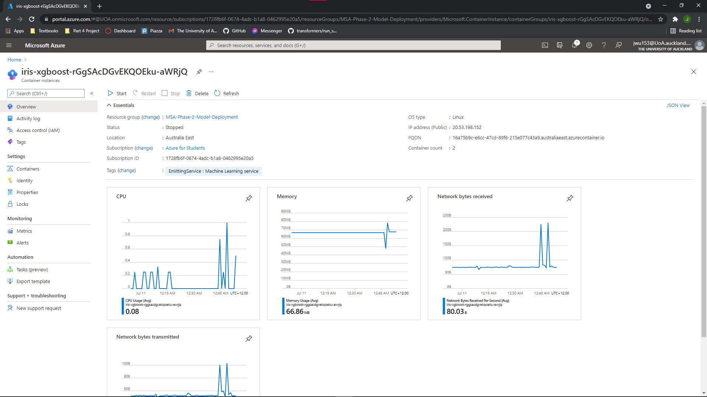

# Model Deployment 

For those that are familiar with full stack software development, deployment is a key skill in DevOps that make a software system available for use, and nowadays, it is commonly achieved through the cloud via services such as Microsoft's Azure and Amazon's AWS. Similarly, a data scientist can also deploy machine learning models via cloud services for production level applications. 

**NOTE: The "example" folder contains all the sample code used in this tutorial**

## Software Installations and Prerequisites 

1. Microsoft Azure (Student account)
2. Python or Anaconda 
3. ```pip install azureml-core```

## Microsoft Azure - Machine Learning (Setup)

We need to setup a cloud service to host our machine learning model, and in this tutorial we will be using Microsoft Azure Machine Learning Studio.

1. Go to the Microsoft Azure dashboard


2. Look for the Machine Learning module/resource. You can easily find this by either using the search bar at the top or click the "+" button labelled "Create a resource"


3. Create the Machine Learning resource by filling in the details. 
   1. NOTE: You can name things however you want, but just make sure they make sense to your project. 
   2. NOTE: The region 


4. Click "Review + Create" and then it should take you to the deployment page. Once deployment, click "Go to Resource", which should take you to the resource page. From there, click launch studio.


## Example of Hosting via Jupyter Notebook

### Model Training 

Before we host/deploy our model we would first need to train one. In this example, I trained a XGBoost model on the well known iris dataset. 

For the MSA data science phase 2 project, you would be training on the CommonLit Readability data from the [Kaggle]( https://www.kaggle.com/c/commonlitreadabilityprize/overview Kaggle) competition. Therefore, you need to adapt this guide to fit the types of model you might be training, but the overall deployment process should be the same. If you are stuck you can access the [Official Microsoft Documentation](https://docs.microsoft.com/en-us/azure/machine-learning/how-to-deploy-and-where?tabs=azcli) which will guide you to deploying any type of machine learning model.

Feel free to use this sample code and practice how to train a model then deploy it :)

```python
# Example model training on the iris dataset 
# Load libraries for creating a xgboost model of the iris dataset 
from sklearn import datasets
from sklearn.model_selection import train_test_split
from xgboost import XGBClassifier

# Load the data 
iris = datasets.load_iris() 
X = iris.data                
y = iris.target      

# Split data into test and train 
X_train, X_test, y_train, y_test = train_test_split(X, y, test_size = 0.2, random_state = 42)

# Create XGBoost classifier and save model 
xgbClf = XGBClassifier(use_label_encoder = False)
xgbClf.fit(X_train, y_train)
xgbClf.save_model("model.json")
```

### Model Deployment 

Assuming that we have a fully trained machine learning model, we can deploy it either via our Jupyter Notebook in Python or online through the Machine Learning Studio. Deploying via Python code is easier and more well documented, so I recommend you do that. 

1. First we need the azureml-core Python module. Install this in a command window of your choice 

   ```pip install azureml-core``` 

   **NOTE: If you are running into a ruamel error, scroll down to the troubleshooting section at the bottom.**

2. Navigate to the azure portal and find the machine learning resource that you created earlier and download the ```config.json``` file. Save this to your working directory of your Jupyter Notebook as we will need this config file to connect our machine learning workspace and deploy our model.

   

3. Connect to our workspace

```python
# Load workspace 
from azureml.core import Workspace
ws = Workspace.from_config(path = "config.json")
print(ws)
```

If you run this code in Jupyter Notebook, it should open a web browser window where you have to sign-in to Azure. Follow the instructions there and you should see an output Workspace.create(...) if you connected successfully. 


**Note: You may encounter connection errors to your Azure ML workspace. I found that the connection hangs even if you sign-in successfully. Things you may want to try to fix any connection errors:****

- **Clear cache and sign-out of Azure**
- **Try incognito mode or alternative web browser**
- **Run this chunk of code in a Google Colab (in your browser) and connect there once then try again in your local Jupyter Notebook**

4. Register our model that we saved earlier with the appropriate model name 

```python
from azureml.core.model import Model

# Register model
model = Model.register(ws, model_name = "iris-xgboost", model_path = "model.json")
```

5. Registering the model merely uploads a model file onto the cloud, but there is no code/instructions to interface with it. We need to create an entry script file (scoring file) that will run when we receive data. This file should load the model, process the data and return the model's response to the client. ***The script is therefore specific to your model***. According to the documentation, the entry script requires two things:

   1. Loading your model using a function called ```init()```
   2. Running model on the input data using a function called ```run()```

   For our iris example, we would do something like this 

   ```python
   # Load libraries 
   import json
   import os 
   import numpy as np
   from xgboost import XGBClassifier
   
   # Since model works with label encoded data, we can create a dictionary to get the acutal class names
   classes = {0: "setosa", 1: "versicolor", 2: "virginica"}
   
   # 1. Requried init function
   def init():
       # Create a global variable for loading the model
       global model
       model = XGBClassifier(use_label_encoder = False)
       model.load_model(os.path.join(os.getenv("AZUREML_MODEL_DIR"), "model.json"))
   
   # 2. Requried run function
   def run(request):
       # Receive the data and run model to get predictions 
       data = json.loads(request)
       data = np.array(data["data"])
       res = model.predict(data)
       return [classes.get(key) for key in res]
   ```

   ***For your project, you must be able to write an entry script that works specifically to your model.*** 

6. After registering our model, we need to setup the remote virtual environment. Under the hood, Microsoft is creating a docker containing that contains our Python environment running our model. Interfacing with our model is achieved via REST API. 

   1. We want the remote environment to have exactly the same Python versions/modules as our local machine. I have noticed that using the ```Environment.from_existing_conda_environment()``` method results in deployment errors, but is the easiest way so try this first.
   2. If you are receiving deployment errors then try the second method which is to manually add packages as required.

```python
from azureml.core import Environment
from azureml.core.conda_dependencies import CondaDependencies
from azureml.core.model import InferenceConfig

# 1. Create environment from existing conda environment 
env = Environment.from_existing_conda_environment(name = "iris-xgboost",
                                                conda_environment_name = "azure")

# 2. Create environment 
env = Environment(name = "iris-xgboost")
conda_dep = CondaDependencies()
conda_dep.add_conda_package("numpy")
conda_dep.add_conda_package("xgboost")
env.python.conda_dependencies = conda_dep

dummy_inference_config = InferenceConfig(
    environment = env,
    source_directory = "./source_dir",
    entry_script = "./echo_score.py",
)
```

7. Now we are ready to deploy our model!

```python
from azureml.core.webservice import AciWebservice
# NOTE: You may need more CPU or memeory depending on what kinds of model you end up using
aci_config = AciWebservice.deploy_configuration(cpu_cores = 1, memory_gb = 1)
service = Model.deploy(
    ws,
    "iris-xgboost",
    [model],
    dummy_inference_config,
    aci_config,
    overwrite = True,
)
service.wait_for_deployment(show_output = True)
```

Once the model has been deployed, you should be able to see it under the endpoints tab in the Azure ML studio


8. We can use any tool now to test our endpoint using REST API calls. If it returns data then you have successfully deployed and hosted your very first ML model! 

Postman test 


Python test 

```python
import requests
import json

uri = service.scoring_uri
requests.get("http://16a75b9c-e6cc-47cd-89f6-215e077c43a9.australiaeast.azurecontainer.io/score")
headers = {"Content-Type": "application/json"}
data = {
    "data": [[6.1, 2.8, 4.7, 1.2]],
}
data = json.dumps(data)
response = requests.post(uri, data = data, headers = headers)
print(response.json())
```

***NOTE: You may want to stop the container instance that hosts your model when not in use because it costs money to host the model.***

***Just find the container instance of your model and press the stop button. You can press start whenever you want to use your model.***



## Troubleshooting 

### 1. ModuleNotFouondError: No module named 'ruamel'

There is currently a bug in the latest anaconda versions and the azureml.core library that results in this error, due to a higher pip version not installing the correct ruamel module.


Solution - Create a new anaconda/python virtual environment and use the downgraded pip version 

1. Open anaconda navigator and create a new virtual environment using the "create" button

2. Name your environment something sensible and choose Python 3.8 

   

3. Once we have created the virtual environment, open up "anaconda prompt" and downgrade the pip version and then install azureml.core
   1. ```conda activate <name of your virtual environment>```
   2. ```pip install pip==20.1.1```
   3. ```pip install azureml-core```


