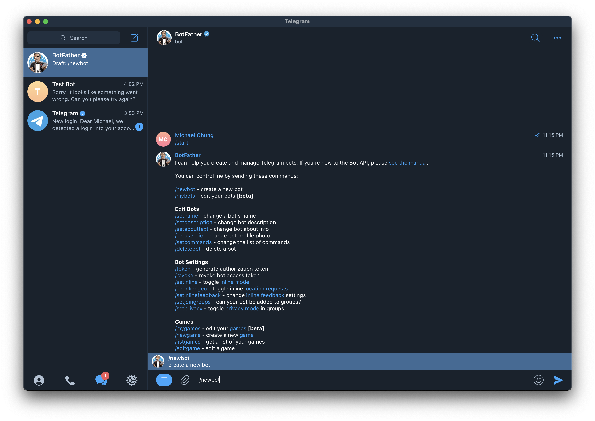
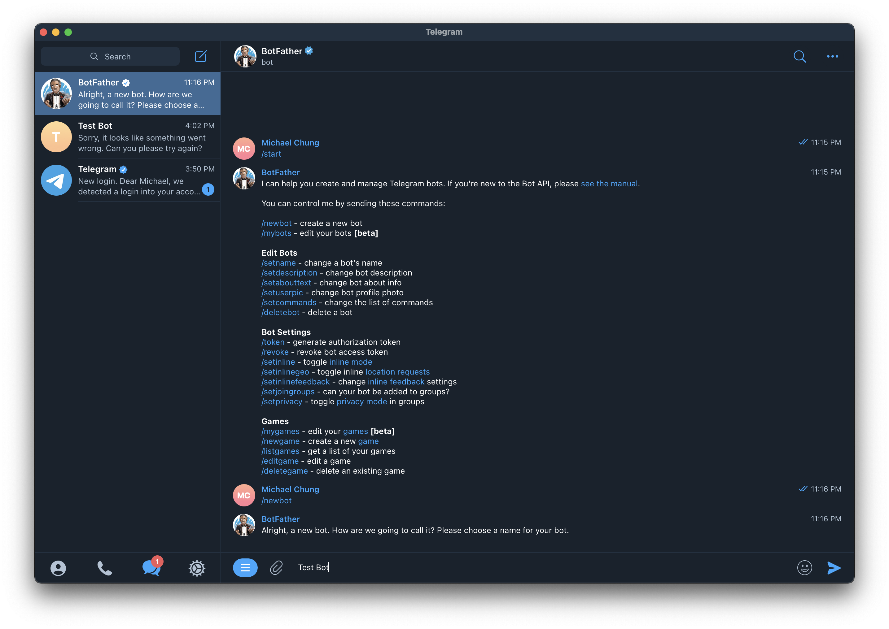
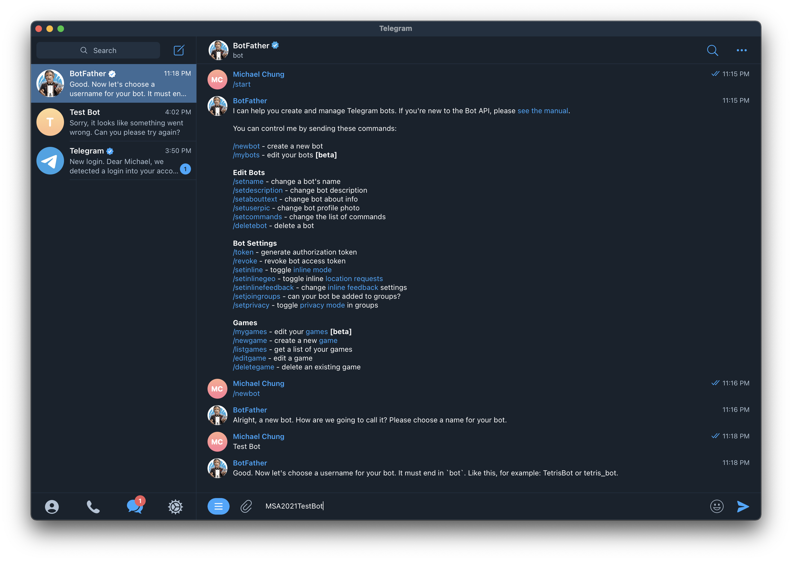
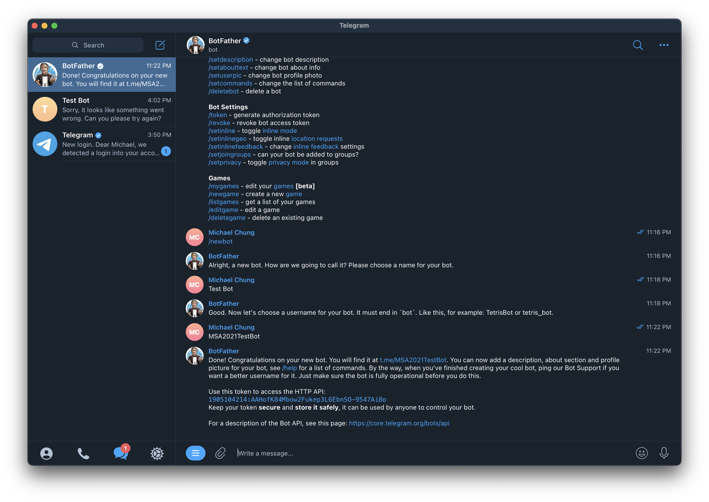
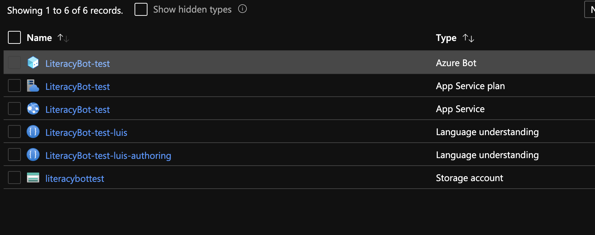
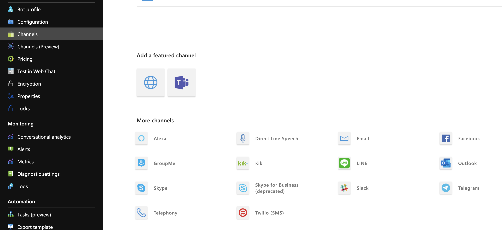
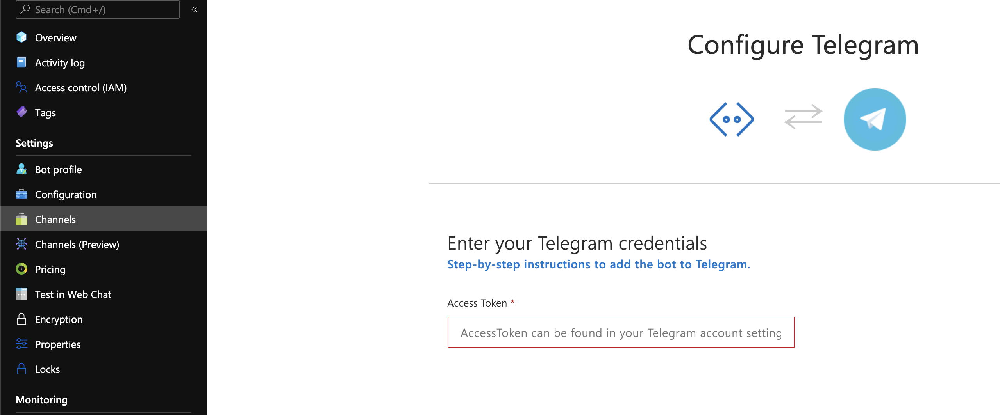
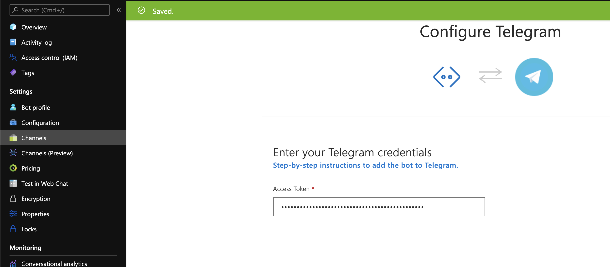

# Connecting the Bot to Channels

Once you've successfully deployed and published your bot onto Microsoft Azure, we can begin connecting it to platforms such as Telegram to allow users to seamlessly access the bot. 

**Please note that this guide will only be going over connecting the bot to Telegram. We encourage you to explore different means of connecting your bot to the different platforms available**

## Prerequisites

1. Telegram account

## Create a new Telegram bot with the Bot Father

We will use the [Bot Father](https://telegram.me/botfather) which is Telegram's means of creating new bots and managing existing bots.

1. Create a new Telegram bot

2. Give your bot a name. (This is the name you'll see at the top of your conversation window)

3. Give your bot a unique username

4. Copy the access token

## Enter the Telegram bot's access code

1. Open up Azure and go to your `Azure Bot` resource

2. Go to your bot's `Channels` section in the Azure portal and click the **Telegram** button

3. Paste the token you copied from Bot Father into the Access Token field and click save

4. Your bot is now sucessfully connected to Telegram

